# GituhbStarRepos App ✨📱🚀

## Overview 🌟📱🧪🔧🚀
- Application for exploring and viewing starred github repositories 📱🌟✨
- Implement a test-driven development (TDD) approach to ensure high code quality and reliability 🧪📝
- Utilize a multi-module architecture to achieve modularity and maintainability 🧩
- Integrate Hilt for dependency injection and enhance code organization 🗝️
- Utilize Coroutines and Flow for asynchronous programming and reactive data streams ⚡🌊
- Follow Material Design guidelines to provide a visually appealing and user-friendly interface 🎨

## Previews 📷

### 🌞 Light Theme 🌞

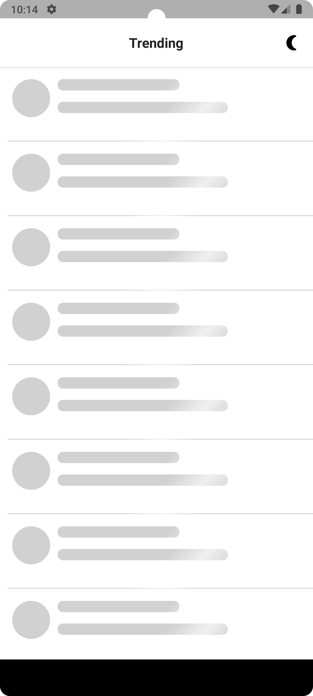
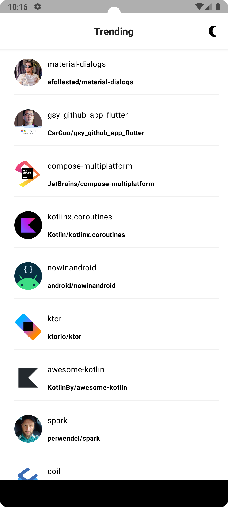
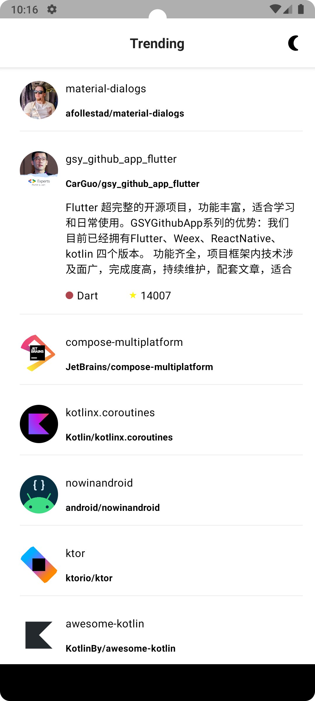
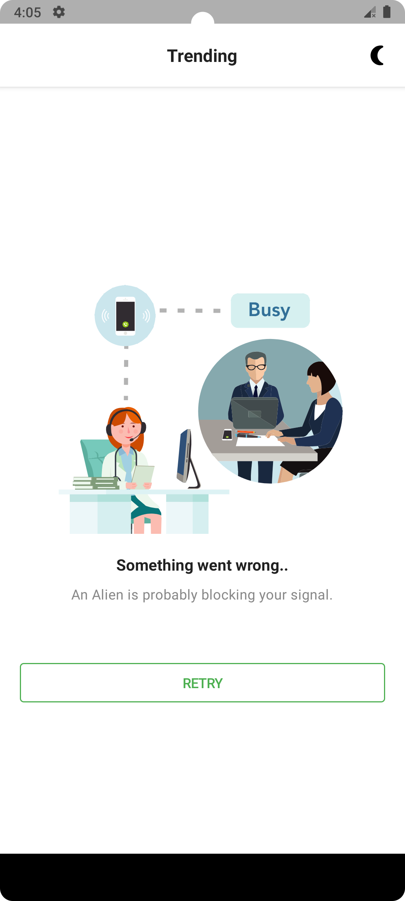
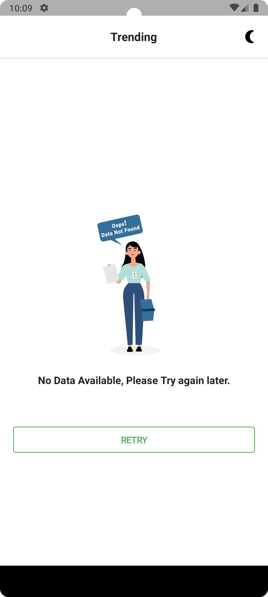

### 🌑 Dark Theme 🌑

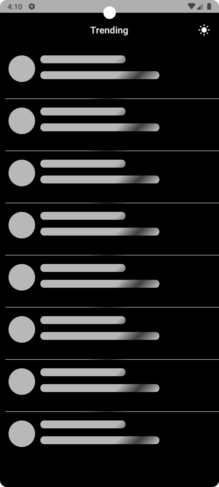
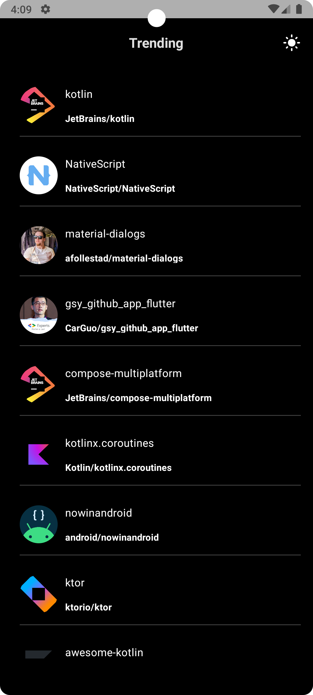
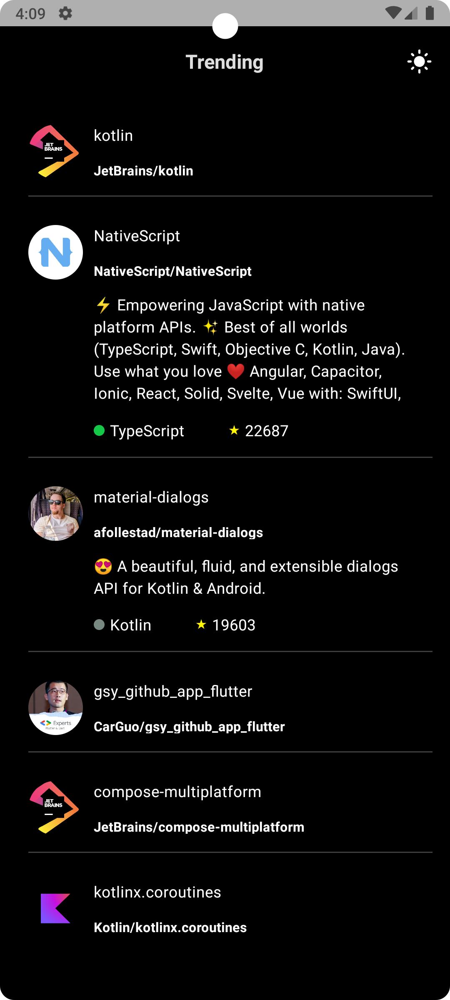
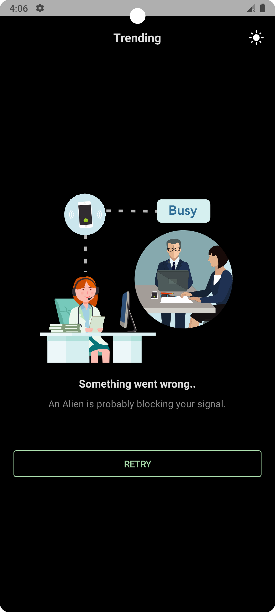
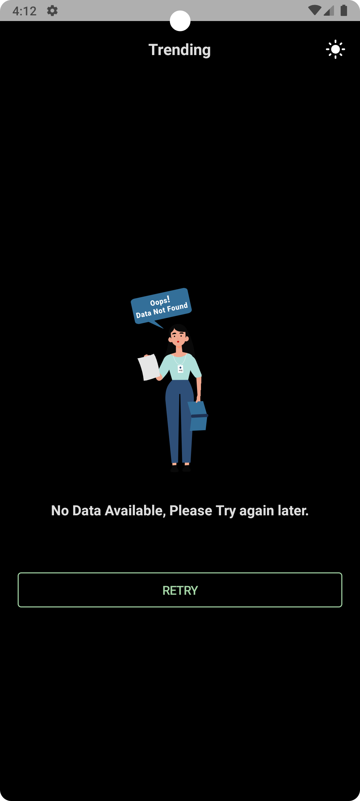

## Test Cases 🧪

#### 🔬 Unit Tests  (with code coverage) 🔬
includes unit tests of Network module, data module( repository layer), common module, Feature module (ViewModels)

 

 

 

#### 📱 UI Tests 📱

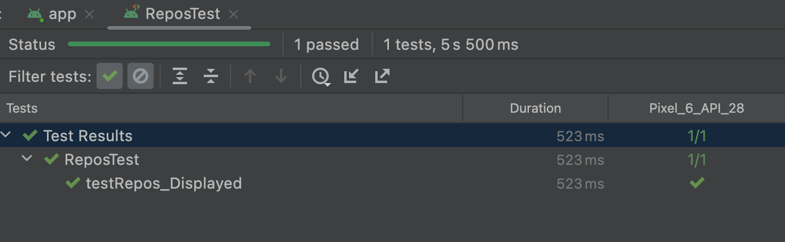

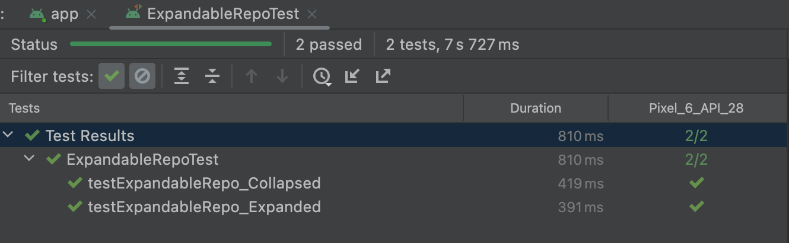 

 

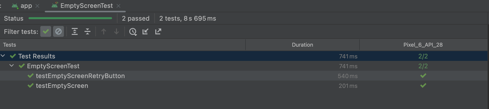 

## Tech Stack & Open Source Libraries 🛠
- [Android Architecture Components](https://developer.android.com/topic/libraries/architecture) - Collection of libraries that help you design robust, testable, and maintainable apps.

- 100% [Jetpack Compose](https://developer.android.com/jetpack/compose) based + [Coroutines](https://github.com/Kotlin/kotlinx.coroutines) + [Flow](https://kotlin.github.io/kotlinx.coroutines/kotlinx-coroutines-core/kotlinx.coroutines.flow/) for asynchronous.
- Jetpack
    - [Compose](https://developer.android.com/jetpack/compose): Android’s modern toolkit for building native UI.
    - [ViewModel](https://developer.android.com/topic/libraries/architecture/viewmodel): UI related data holder and lifecycle aware.
    - [Hilt](https://dagger.dev/hilt/): Dependency Injection.
- [Retrofit2 & OkHttp3](https://github.com/square/retrofit): Construct the REST APIs and paging network data.
- [viewmodel-lifecycle](https://github.com/skydoves/viewmodel-lifecycle): ViewModel Lifecycle allows you to track and observe Jetpack's ViewModel lifecycle changes.

## Architecture 🏛️
This app has been fully modularized.

### 🌟 Overview 🌟
Modularization is the practice of breaking the concept of a monolithic, one-module codebase into
loosely coupled, self contained modules.

### 💡 Benefits of Modularization 💡

This offers many benefits, including:

**Scalability** - In a tightly coupled codebase, a single change can trigger a cascade of
alterations. A properly modularized project will embrace
the [separation of concerns](https://en.wikipedia.org/wiki/Separation_of_concerns) principle. This
in turn empowers the contributors with more autonomy while also enforcing architectural patterns.

**Enabling work in parallel** - Modularization helps decrease version control conflicts and enables
more efficient work in parallel for developers in larger teams.

**Ownership** - A module can have a dedicated owner who is responsible for maintaining the code and
tests, fixing bugs, and reviewing changes.

**Encapsulation** - Isolated code is easier to read, understand, test and maintain.

**Reduced build time** - Leveraging Gradle’s parallel and incremental build can reduce build times.

**Dynamic delivery** - Modularization is a requirement
for [Play Feature Delivery](https://developer.android.com/guide/playcore/feature-delivery) which
allows certain features of your app to be delivered conditionally or downloaded on demand.

**Reusability** - Proper modularization enables opportunities for code sharing and building multiple
apps, across different platforms, from the same foundation.

### 📦 Types of Modules in GitHubStarRepos 📦
- The `app` module - contains app level and scaffolding classes that bind the rest of the codebase,
  such as `MainActivity`. The `app` module depends on all `feature` modules and
  required `core` modules.

- `feature:` modules - feature specific modules which are scoped to handle a single responsibility
  in the app. These modules can be reused by any app, including test or other flavoured apps, when
  needed, while still keeping it separated and isolated.

- `core:` modules - common library modules containing auxiliary code and specific dependencies that
  need to be shared between other modules in the app. These modules can depend on other core
  modules, but they shouldn’t depend on feature nor app modules.

### 🧩 Modules 🧩
<table>
  <tr>
   <td><strong>Name</strong>
   </td>
   <td><strong>Responsibilities</strong>
   </td>
  </tr>
  <tr>
   <td><code>app</code>
   </td>
   <td>Brings everything together required for the app to function correctly. This includes UI scaffolding and navigation. 
   </td>
  </tr>
  <tr>
   <td><code>feature:1,</code> 
   ...
   </td>
   <td>Functionality associated with a specific feature or user journey. Typically contains UI components and ViewModels which read data from other modules. 
   Examples include: 
   <ul>
    <code>feature:trending</code> displays information about starred repositories of specific programming language
    </ul>
   </td>

  </tr>
  <tr>
   <td><code>core:data</code>
   </td>
   <td>Fetching app data from multiple sources, shared by different features.
   </td>
  </tr>
  <tr>
   <td><code>core:ui</code>
   </td>
   <td>Composite UI components and resources used by feature modules, such as the repos feed. It is dependent on the data layer since it renders models, like star repos. 
   </td>
  </tr>
  <tr>
   <td><code>core:common</code>
   </td>
   <td>Common classes shared between modules.
   </td>
  </tr>
  <tr>
   <td><code>core:network</code>
   </td>
   <td>Making network requests and handling responses from a remote data source.
   </td>
  </tr>
  <tr>
   <td><code>core:testing</code>
   </td>
   <td>Testing dependencies, repositories and util classes.
   </td>
  </tr>
  <tr>
   <td><code>core:datastore</code>
   </td>
   <td>Storing persistent data using DataStore.
   </td>
  </tr>
  <tr>
   <td><code>core:model</code>
   </td>
   <td>Model classes used throughout the app.
  </tr>
</table>

## Developed by 👨‍💻

**Mirza Arslan**

